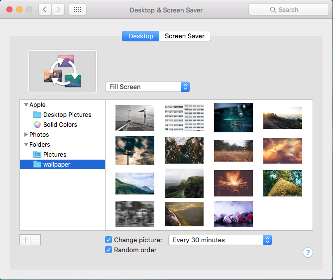

# Unsplash Wallpaper downloader

This script will download random images from unsplash.com 
and store them in a local folder, so that they can be displayed as wallpapers.
 
 
## Setup
 
You're going to need some Unsplash dev credentials. 
Yea, that's a hassle but since you already have uncountably many accounts
at innumerable web services, one more won't hurt.
 
1. Go to [Unsplash](https://unsplash.com/developers) and register for a developer account
2. Create an application [here](https://unsplash.com/oauth/applications) (ignore the callbackUrl)
3. Duplicate `config/unsplash_example.js` and rename it to `config/unsplash.js`
3. An copy `Application ID` and `secret` into your `config/unsplash.js` which is gitignored.

 
    npm install
    
Then a patch of the unsplash-js library is required since its feature set is trimmed. 
(I know, a pull request would be best. But I have a notion, why this feature is not included)

Open `node_modules/unsplash-js/lib/methods/photos.js` in the `getRandomPhoto` method the `query` object mapping 
swallows some parameters that actually are available via unsplash API and used by this script.

Change
 
    ...
    var query = {
      category: options.category,
    ...  

to

    ...
    var query = {
      count: options.count,
      orientation: options.orientation,
      category: options.category,
    ...  

DO NOT DO THIS IN THE OFFICE!

This is really BAD practice and will cause other people to think badly of you.
 
Yet, since this project is just a playground experiment, let's ignore this direful approach. 
Oh, and if you happen to create a fork of unsplash-js including these changes and put it on npm, Please let me know ;-)
 

## Run

    npm start

This will download 15 random images to the `images/wallpaper` folder.

## Next steps

1. Setup your desktop to randomly display images in a folder as wallpapers. If your computer can't do this, buy a Mac.

2. Configure a cron job to move old images to `images/archive` and execute the script every X minutes. (The API key will allow 50 executions per hour)